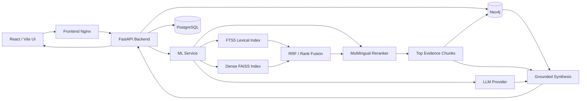

# Научный клубок

**Научный клубок** — Hybrid GraphRAG-платформа для поиска, анализа и навигации по научно-техническим знаниям в больших разнородных корпусах документов. Система объединяет полнотекстовый и векторный поиск, числовые ограничения, граф знаний, provenance до страницы/фрагмента и grounded LLM-синтез.

> Проект создан для анализа R&D-корпусов в горно-металлургической и смежных отраслях, но архитектура не привязана к одному домену и масштабируется на новые предметные области.

---

## Возможности

- **Hybrid retrieval по полному корпусу**
  - lexical search на FTS5;
  - multilingual dense embeddings;
  - Reciprocal Rank Fusion;
  - multilingual cross-encoder reranking;
  - фильтрация по правам доступа.

- **GraphRAG**
  - selective graph expansion только от реально найденных evidence chunks;
  - факты, сущности, отношения, источники, эксперты, лаборатории и патенты;
  - provenance bridge `retrieval chunk -> Neo4j facts -> subgraph`.

- **Числовые ограничения**
  - извлечение, температура, давление, pH и другие параметры;
  - операторы `=`, `<`, `<=`, `>`, `>=`, `between`;
  - защита от ложных positive matches.

- **Grounded synthesis**
  - ответы строятся по найденным evidence и graph facts;
  - ссылки на evidence;
  - confidence;
  - специальные guards для противоречий и экспертных ответов;
  - fallback при недоступности LLM.

- **Загрузка пользовательских PDF**
  - PDF становится searchable сразу после Upload;
  - persistent retrieval overlay;
  - lexical + dense indexing;
  - отдельный `Process selected` для LLM extraction и Neo4j enrichment.

- **Human-in-the-loop**
  - редактор фактов;
  - версии;
  - статусы верификации;
  - audit trail.

- **Экспорт**
  - Markdown;
  - JSON-LD;
  - PDF.

- **Role-based access**
  - `external_partner`;
  - `researcher`;
  - `analyst`;
  - `manager`;
  - `admin`.

---

## Демо-стенд

Текущий демонстрационный корпус включает:

- **1 453 файла**;
- около **4,86 ГБ** исходных данных;
- более **1 300 разобранных документов**;
- **136 354 chunks** в retrieval-корпусе;
- selective LLM enrichment для высокоценных фрагментов;
- сотни graph facts, entities и relations в Neo4j.

Поддерживаемые форматы парсинга включают PDF, DOCX/DOCM, PPTX, XLSX/XLS, DOC и архивные контейнеры при наличии соответствующих зависимостей.

---

## Архитектура



Основной pipeline:

```text
Query
  ↓
QueryPlan
  ↓
Lexical + Dense + Numeric Constraints
  ↓
RRF
  ↓
Cross-Encoder Reranking
  ↓
Top Evidence Chunks
  ↓
Neo4j Provenance Bridge
  ↓
Facts / Entities / Relations
  ↓
Grounded LLM Synthesis
  ↓
Answer + Evidence + Graph + Experts
```

Ключевой принцип GraphRAG:

- **явные пользовательские фильтры** применяются строго;
- **семантика, выведенная из свободного текста**, используется как soft ranking signal;
- **числовые constraints** проверяются на retrieval-слое;
- граф расширяется только от найденных provenance chunks.

---

## Стек

### Frontend

- React
- TypeScript
- Vite
- Nginx

### Backend

- FastAPI
- Pydantic
- httpx
- PostgreSQL
- Neo4j driver

### ML / Retrieval

- Sentence Transformers
- FAISS
- SQLite FTS5
- multilingual embeddings
- `BAAI/bge-reranker-v2-m3`
- numeric constraint parser
- Hybrid RRF retrieval

### Infrastructure

- Docker
- Docker Compose
- NVIDIA GPU support
- persistent Hugging Face cache

---

## Быстрый старт

### Требования

- Docker Engine или Docker Desktop;
- Docker Compose v2;
- для GPU-режима:
  - NVIDIA GPU;
  - актуальный NVIDIA driver;
  - рабочий Docker GPU passthrough.

Проверка GPU:

```bash
docker run --rm --gpus all \
  nvidia/cuda:12.4.1-base-ubuntu22.04 \
  nvidia-smi
```

---

### 1. Клонировать репозиторий

```bash
git clone [dddert/The-Knot](https://github.com/dddert/The-Knot.git)
cd The-Knot
git lfs install
git lfs pull
```

---

### 2. Создать `.env`

Минимальный пример:

```env
USE_MOCK_ML=false

LLM_PROVIDER=yandex
YANDEX_API_KEY=replace_me
YANDEX_FOLDER_ID=replace_me
YANDEX_MODEL=yandexgpt-5-lite

INSTALL_DENSE_ML=1
DENSE_ENABLED=true
LEXICAL_ENABLED=true

EMBEDDING_MODEL=sentence-transformers/paraphrase-multilingual-MiniLM-L12-v2
RERANKER_MODEL=BAAI/bge-reranker-v2-m3
RERANKER_BATCH_SIZE=4
RERANKER_MAX_LENGTH=512

RETRIEVAL_DENSE_K=200
RETRIEVAL_LEXICAL_K=200
RETRIEVAL_RRF_K=60
RETRIEVAL_RERANK_POOL=50

QUERY_LLM_TIMEOUT_SECONDS=12
QUERY_LLM_MAX_ATTEMPTS=1
QUERY_DETERMINISTIC_FAST_SCORE=4
```

> Не коммитьте `.env` и реальные API-ключи.

---

### 3. Подготовить retrieval data

Ожидаемая структура:

```text
ml-data/
├── input/
│   └── demo_extracted_documents_fixed.jsonl
└── retrieval-index/
    ├── lexical.sqlite3
    ├── dense.faiss
    ├── embeddings.f32
    ├── metadata.jsonl
    └── index_config.json
```

Большие retrieval artifacts не следует хранить как обычные Git blobs. Используйте Git LFS или отдельное объектное хранилище.

---

### 4. Запустить систему

```bash
docker compose up -d --build
```

Текущий startup flow автоматически:

1. поднимает Neo4j и PostgreSQL;
2. запускает Backend;
3. запускает ML API;
4. импортирует demo graph payload;
5. скачивает отсутствующие веса моделей;
6. загружает dense model и reranker;
7. выполняет warmup retrieval request;
8. выставляет ML readiness;
9. только после этого запускает Frontend.

Проверить состояние:

```bash
docker compose ps
```

Ожидаемо:

```text
backend       healthy
ml-service    healthy
neo4j         healthy
postgres      healthy
frontend      running
```

Логи cold start:

```bash
docker compose logs -f ml-service
```

Успешный startup заканчивается сообщением:

```text
[startup] READY: import complete; dense and reranker warm
```

---

## URL сервисов

| Сервис | URL |
|---|---|
| Frontend | `http://localhost:3000` |
| Backend API | `http://localhost:8000` |
| ML Service | `http://localhost:9000` |
| Neo4j Browser | `http://localhost:17474` |

Для внешней публикации достаточно проксировать **только Frontend**. Nginx внутри frontend-контейнера проксирует `/api/` в backend.

---

## Работа с пользовательскими PDF

### Upload

На вкладке **Import** пользователь выбирает PDF и уровень доступа:

- `public`;
- `internal`;
- `confidential`.

После Upload:

```text
PDF
  ↓
page text extraction
  ↓
chunking
  ↓
persistent uploaded retrieval overlay
  ↓
lexical + dense indexing
  ↓
document becomes searchable
```

Пользователь может сразу перейти в Search и задавать вопросы по новому документу.

Uploaded index хранится в:

```text
/data/retrieval-index/uploaded-documents
```

При стандартном volume mapping он сохраняется между рестартами контейнеров.

### Process selected

Отдельная операция выполняет более дорогой pipeline:

```text
retrieval upsert
  ↓
LLM extraction
  ↓
entities
  ↓
facts
  ↓
relations
  ↓
Neo4j import
```

Это позволяет разделить быстрый searchable upload и graph enrichment.

> PDF без текстового слоя требуют OCR и не являются основным сценарием текущего pipeline.

---

## Примеры запросов

### Технологический обзор

```text
Какие технологии кучного выщелачивания применяются в условиях холодного климата?
```

### Переработка техногенных материалов

```text
Какие способы переработки техногенного гипса описаны в корпусе?
```

### Numeric negative control

```text
Найди процессы с извлечением никеля не менее 90% при температуре ниже 100 °C
```

Ожидаемое поведение: система не должна возвращать похожие, но не удовлетворяющие условиям evidence.

### Numeric positive control

```text
Найди процессы с извлечением меди не менее 90% при температуре выше 200 °C
```

### Эксперты и лаборатории

```text
Какие эксперты и лаборатории занимаются автоклавным выщелачиванием?
```

### Противоречия

```text
Найди противоречивые данные о влиянии температуры на извлечение меди из металлургических шлаков
```

### Пробелы в знаниях

```text
Какие пробелы в исследованиях кучного выщелачивания в холодном климате видны по найденным источникам?
```

### Патенты

```text
Какие патенты и технологические решения по автоклавному выщелачиванию упоминаются в корпусе?
```

---

## Search filters

Search поддерживает комбинации свободного запроса с явными фильтрами:

- `process`;
- `material`;
- `country`;
- `year_from`;
- `year_to`;
- `geo_scope`;
- `status`;
- `fact_type`;
- `confidence_min`;
- numeric filters.

Пример:

```text
Query:
Какие экономические параметры технологии описаны?

Process:
mine water deep injection

Country:
WORLD

Year from:
2024

Year to:
2024

Status:
auto_extracted

Fact type:
technology_economic_indicator

Confidence min:
0.78
```

---

## Compare

Вкладка **Compare** группирует extracted facts по:

- `geo_scope`;
- `country`;
- `status`;
- `fact_type`.

Пример:

```text
Process:
mine water deep injection

Group by:
country
```

Для наиболее показательного демо рекомендуется выбирать процесс с несколькими связанными фактами.

---

## Role-based access

| Роль | Основные возможности |
|---|---|
| `external_partner` | public search / evidence |
| `researcher` | import, search, graph, dashboard |
| `analyst` | search, graph, fact editing, export |
| `manager` | extended access, confidential uploads, audit |
| `admin` | полный доступ |

Backend повторно проверяет доступ к данным независимо от UI.

---

## Основные API endpoints

### Backend

```text
GET  /health
POST /api/search
POST /api/documents/upload
POST /api/documents/{document_id}/process
POST /api/documents/import-extracted
GET  /api/dashboard/coverage
```

### ML Service

```text
GET  /health
POST /ml/extract
POST /ml/index-document
POST /ml/parse-query
POST /ml/retrieve
POST /ml/synthesize-answer
```

---

## Структура проекта

```text
.
├── backend/
│   └── app/
│       ├── api/
│       ├── services/
│       ├── schemas/
│       └── main.py
├── frontend/
│   ├── src/
│   ├── nginx.conf
│   └── Dockerfile
├── ml-service/
│   ├── app/
│   ├── pipeline/
│   ├── scripts/
│   └── Dockerfile
├── ml-data/
│   ├── input/
│   └── retrieval-index/
├── scripts/
├── docker-compose.yml
└── README.md
```

---

## Проверка состояния

### Backend

```bash
curl -s http://localhost:8000/health
```

### ML

```bash
curl -s http://localhost:9000/health
```

### GPU

```bash
docker compose exec ml-service python - <<'PY'
import torch

print("cuda =", torch.cuda.is_available())
if torch.cuda.is_available():
    print("device =", torch.cuda.get_device_name(0))
PY
```

### Coverage

```bash
curl -sS \
  'http://localhost:8000/api/dashboard/coverage?user_id=tester&role=analyst' \
  -H 'X-Demo-Role-Token: analyst-token'
```

---

## Regression smoke tests

Критические сценарии:

### Negative numeric

```text
Найди процессы с извлечением никеля не менее 90% при температуре ниже 100 °C
```

Ожидаемо:

```text
facts = 0
evidence = 0
```

### Positive numeric

```text
Найди процессы с извлечением меди не менее 90% при температуре выше 200 °C
```

Ожидаемо:

```text
facts > 0
evidence > 0
```

### Expert GraphRAG

```text
Какие эксперты и лаборатории занимаются автоклавным выщелачиванием?
```

Ожидаемо:

```text
facts > 0
experts > 0
graph nodes > 0
```

---

## Команда

The Sigmoid Tangents - Андрей Волков, Артём Грызунов
